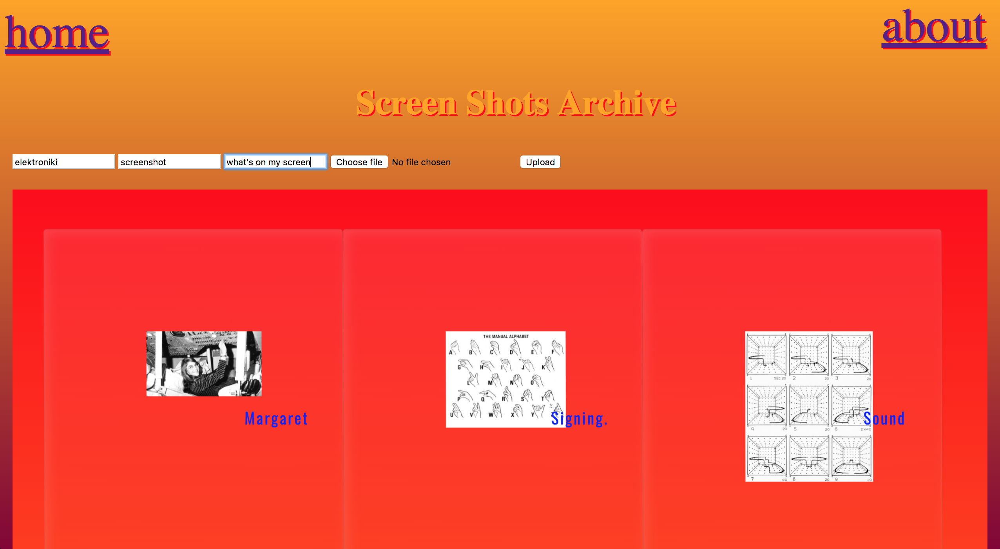

# What Is The Internet?

> Working with **AngularJS**, I created a Pinterest like website called **What is the Internet?**
>
> In this website, users are invited to log-in, upload, view and comment on images and more specifically screenshots representing each user’s everyday ‘surfing’ experience, in order to collectively visualise and explore what internet is.

> User can scroll through, upload and comment on individual pictures of other users.

